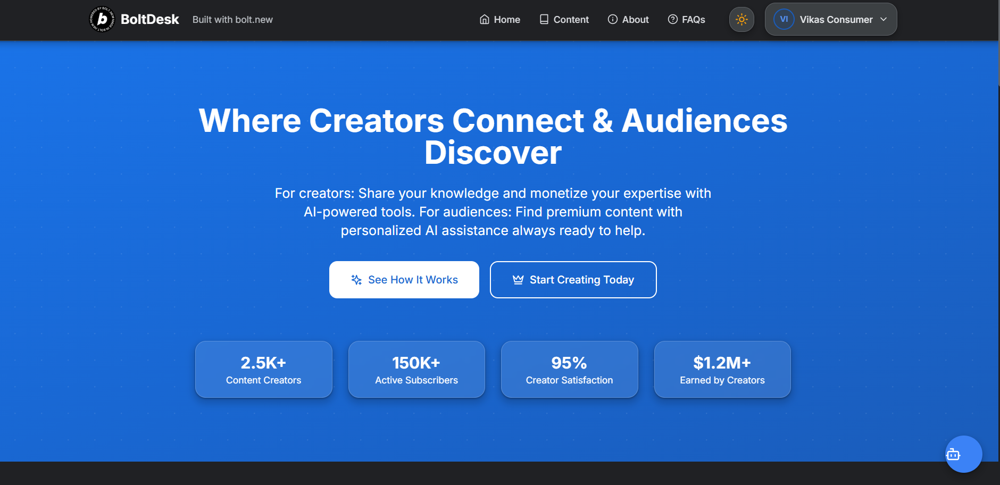

# BoltDesk - AI-powered Creator Micro-Portal

BoltDesk is an innovative platform that bridges the gap between content creators and their audiences through the power of AI. It provides a centralized hub for creators to share knowledge, monetize content, and engage with their audience while giving consumers easy access to premium resources with AI-assisted discovery.



## 🔗 Live Demo

- **Live Application**: [BoltDesk Demo on Netlify](https://zippy-brioche-92a2b7.netlify.app/)
- **Demo Video**: [Watch on YouTube](https://youtu.be/je9FwLgG9sc)

## ✨ What Makes BoltDesk Unique

BoltDesk stands out with its innovative approach to creator platforms:

- **AI-First Design Philosophy**: Every interaction is enhanced with AI capabilities, from content discovery to automated responses.
- **Dual Portal System**: Separate interfaces for creators and consumers with tailored functionality for each user type.
- **Monetization Infrastructure**: Built-in commission structure with support for multiple revenue streams (courses, consulting, digital products).
- **Real-Time AI Assistance**: Personalized AI agents that represent creators even when they're offline.
- **Seamless Experience**: Integration of content, scheduling, payments, and communication in one unified platform.

## Inspiration

The inspiration for BoltDesk came from observing a critical gap in the creator economy. Today's content creators are forced to juggle 5+ disconnected tools (Patreon, Gumroad, Calendly, Notion, Linktree, etc.), leading to fragmented workflows, audience dispersion, and revenue leakage. As a finance professional transitioning into tech, I noticed that despite the explosion of creator tools, there wasn't a truly unified solution that integrated AI throughout the creator journey.

The lightbulb moment came when I realized that AI could do more than just assist creators—it could fundamentally transform how creators engage with their audiences by serving as their always-on digital twin. This would allow creators to scale their personal touch without scaling their time commitment.

## What it does

BoltDesk is an AI-powered micro-portal that centralizes all aspects of a creator's business:

- **AI Persona Creation**: Creators train a personalized AI assistant that represents their voice, knowledge, and expertise, creating a 24/7 presence that engages with their audience
- **Content Monetization Hub**: Unified platform for selling courses, booking consultations, offering digital products, and managing subscriptions
- **Dual Portal System**: Separate interfaces for creators (management dashboard) and consumers (learning experience)
- **Commission-based Revenue Model**: Simple pricing with lower transaction fees than using multiple platforms (3% vs 8-12%)
- **Custom Domain Support**: Professional branding with seamless domain integration
- **Audience Analytics**: Comprehensive insights into engagement, conversion, and revenue metrics

The platform's core innovation is how it uses AI not just as a feature, but as the backbone that connects every interaction between creators and their audience.

## How we built it

BoltDesk was built using a modern tech stack designed for performance and scalability:

1. **Frontend Architecture**: We created a responsive React application with TypeScript for type safety and better development experience. The dual-portal system required careful component design to maintain consistency while serving different user types.

2. **UI Development**: Tailwind CSS provided a utility-first approach that enabled rapid development of a beautiful, consistent interface. We enhanced this with Framer Motion animations to create a polished, engaging experience.

3. **State Management**: Zustand offered lightweight but powerful state management with persistence capabilities, making the app responsive and maintaining user state across sessions.

4. **Mock Data System**: We implemented a robust system to simulate backend functionality, allowing us to demonstrate the full capabilities of the platform even in prototype form.

5. **AI Integration Points**: We designed specific touchpoints throughout the application where AI services would integrate (chat interfaces, content analysis, personalization systems).

6. **Deployment Pipeline**: We set up Netlify for continuous deployment, allowing for rapid iteration and testing.

The development process followed a user-centered design approach, with the creator and consumer experiences being developed in parallel to ensure they complemented each other perfectly.

## Challenges we ran into

Building BoltDesk presented several significant challenges:

1. **Dual User Experience**: Designing two distinct but interconnected interfaces (creator and consumer) required careful planning. Ensuring a cohesive feel while optimizing for different use cases was a complex balancing act.

2. **State Management Complexity**: With multiple user types, complex dashboards, and real-time interactions, managing application state became challenging. We had to restructure our Zustand store several times to find the optimal architecture.

3. **Responsive Design Considerations**: Creating complex dashboards that work seamlessly on both mobile and desktop required intricate CSS work and component design.

4. **Interaction Design for AI Features**: Designing intuitive interfaces for AI setup, training, and interaction presented unique UX challenges that required multiple iterations.

5. **Performance Optimization**: Ensuring smooth animations and transitions while maintaining performance, especially with data-heavy dashboard components, required careful optimization.

6. **Authentication Flow Complexity**: Implementing a secure yet user-friendly authentication system with role-based access control added significant complexity.

## Accomplishments that we're proud of

Looking back on the development process, several achievements stand out:

1. **Intuitive Setup Wizard**: The AI agent creation flow simplifies what could be a complex process into a few intuitive steps, making advanced technology accessible to non-technical creators.

2. **Comprehensive Analytics Dashboard**: The analytics system provides creators with actionable insights through beautiful visualizations and meaningful metrics.

3. **Seamless Mobile Experience**: Despite the complexity of the application, we achieved a fully responsive design that works flawlessly on all device sizes.

4. **Unified Monetization System**: Successfully integrated multiple revenue streams (courses, consultations, digital products) into a single, easy-to-manage interface.

5. **Accessibility Considerations**: We implemented robust keyboard navigation, appropriate contrast ratios, and screen reader compatibility throughout the application.

6. **Design Language Consistency**: Maintained a coherent design language across both creator and consumer portals, creating a unified brand experience.

## What we learned

The development journey provided valuable insights and learning experiences:

1. **AI Integration Best Practices**: We learned how to design systems that leverage AI capabilities while maintaining a natural, human-centered experience.

2. **Dual-Audience UX Patterns**: We developed effective patterns for creating applications that serve distinct user groups with different needs and technical abilities.

3. **State Management Optimization**: Working with complex state interactions across multiple views taught us advanced state management techniques.

4. **Performance Bottlenecks**: We identified key areas where performance optimizations were critical, particularly in animation-heavy interfaces and data visualization.

5. **Microinteractions Impact**: We discovered how small, thoughtful interactions dramatically improve perceived quality and user satisfaction.

6. **Creator Economy Dynamics**: Through research and user feedback, we gained deeper insights into the unique challenges and opportunities facing modern content creators.

## What's next for BoltDesk - AI powered creator Micro portal

Our roadmap for BoltDesk is ambitious and focused on creating even more value for creators and their audiences:

1. **Advanced AI Capabilities**: Integrating more sophisticated AI models for content generation, video creation, and personalized learning experiences.

2. **Enhanced Voice & Video AI**: Implementing ElevenLabs for more natural voice synthesis and D-ID for dynamic video avatar generation.

3. **Mobile Applications**: Native mobile apps for both creators and consumers to enable on-the-go management and learning.

4. **Expanded Analytics**: More advanced audience insights, predictive revenue forecasting, and content performance analysis.

5. **Community Features**: Built-in community forums, discussions, and collaborative learning environments.

6. **Marketplace Expansion**: Creating a marketplace for creator collaborations, cross-promotion, and content sharing.

7. **API Ecosystem**: Developing a robust API to allow third-party integrations and custom extensions.

8. **Global Payment Solutions**: Supporting multiple currencies and alternative payment methods for international creators.

The long-term vision is to make BoltDesk the central hub where millions of creators can build sustainable businesses while maintaining authentic connections with their audiences.

## 🚀 Features

### For Creators

- **Dashboard & Analytics**: Comprehensive metrics on audience engagement and revenue.
- **Content Management**: Tools to create, organize, and publish various content types.
- **AI Agent Configuration**: Customize your AI assistant's voice, knowledge base, and appearance.
- **Monetization Center**: Set up multiple revenue streams with flexible commission structures.
- **Audience Management**: Track subscriber data and engagement metrics.
- **Custom Domain Support**: Connect your own domain for a branded experience.

### For Consumers/Audience

- **Content Discovery**: Browse and search for courses, tutorials, and resources.
- **Learning Dashboard**: Track progress across various courses and content.
- **Favorites System**: Save content for later consumption.
- **Subscription Management**: Control subscription tiers and payments.
- **AI Assistance**: Get immediate answers about creator content through the AI assistant.

## 🔧 Technology Stack

BoltDesk is built with a modern, performant tech stack:

- **Frontend Framework**: React 18 with TypeScript
- **Routing**: React Router v6
- **State Management**: Zustand with localStorage persistence
- **UI Components**: Custom components built with Tailwind CSS
- **Animations**: Framer Motion for smooth transitions and interactions
- **Icon System**: Lucide React for consistent iconography
- **Charts & Visualizations**: Recharts
- **Build Tool**: Vite
- **Deployment**: Netlify

## 📱 Responsive Design

BoltDesk is fully responsive and works seamlessly across:
- Desktop computers
- Tablets
- Mobile devices

## 🔍 Getting Started

### Demo Accounts

You can log in using the following demo credentials:

- **Creator Account**:
  - Email: creator@example.com
  - Password: password

- **Consumer Account**:
  - Email: consumer@example.com
  - Password: password

### For Developers

1. Clone the repository
2. Install dependencies:
   ```
   npm install
   ```
3. Start the development server:
   ```
   npm run dev
   ```

## 🌐 Deployment

The application is deployed on Netlify with continuous deployment from the main branch. The production build command is:

```
npm run build
```

## 👨‍💻 Creator

BoltDesk was created by **Vikas Sahani**, a finance professional and AI technology enthusiast with a passion for creating practical solutions for content creators.

- **Email**: [vikassahani17@gmail.com](mailto:vikassahani17@gmail.com)
- **GitHub**: [VIKAS9793](https://github.com/VIKAS9793)
- **LinkedIn**: [Vikas Sahani](https://www.linkedin.com/in/vikas-sahani-727420358)

## 📄 License

This project is protected by copyright © 2024 Vikas Sahani. All rights reserved.

"BoltDesk" is a trademark of Vikas Sahani.

## 🙏 Acknowledgements

This application was created using [bolt.new](https://bolt.new), a product that enables rapid web development and deployment.

Third-party tools and services used in this project include:
- React
- Tailwind CSS
- Lucide Icons
- Framer Motion
- TypeScript
- Vite